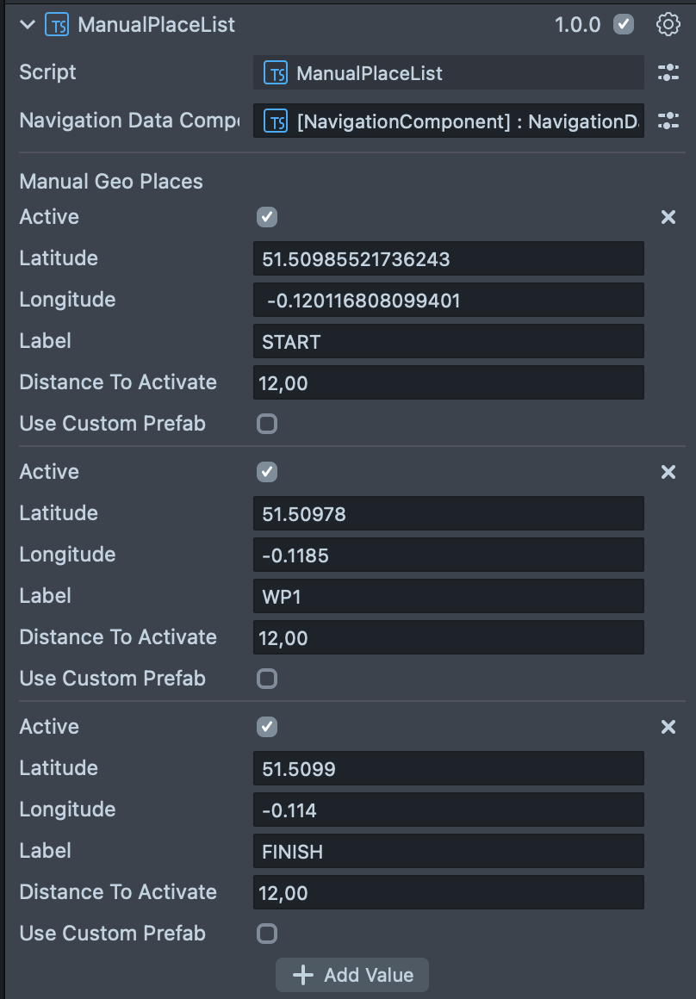

# 🧭 GPS Quest - Шаблон покрокових квестів у реальному світі

> [🇺🇸 English](README.md) | 🇺🇦 **Українська**

Шаблон квестів на основі локацій з відкритим кодом для Snapchat Spectacles, який проводить користувачів через фізичні місця у покроковій пригоді.

> **Частина колекції [Spectacles Projects](../) від Павла Ткаченка**

## 📍 Огляд

GPS Quest v1.0 - це **шаблон квестів у реальному світі**, який створює пригоди на основі локацій, де користувачі повинні фізично подорожувати між GPS-точками для прогресу. На відміну від традиційних навігаційних застосунків, цей шаблон зосереджений на **покроковому проходженні квесту** - користувачі бачать лише свою наступну цільову локацію, заохочуючи дослідження та відкриття.

**Ключова концепція**: Користувачі подорожують від локації до локації в реальному світі, кожна точка маршруту відкриває наступний крок у їхній квестовій подорожі.

## ✨ Функції квесту

### 🚶‍♂️ **Покрокове проходження**
- **Одна точка маршруту за раз**: Користувачі бачать лише свою наступну цільову локацію
- **Поступове відкриття**: Завершення однієї локації відкриває наступну
- **Квестовий досвід**: Створює очікування та заохочує дослідження

### 🌍 **Подорожі між фізичними локаціями**
- **Рух у реальному світі**: Користувачі повинні фізично подорожувати між локаціями
- **Активація на основі локації**: Точки маршруту активуються, коли користувачі прибувають на місце
- **Зовнішні пригоди**: Ідеально підходить для міських турів, квестів-полювань за скарбами та освітніх маршрутів

### 🎯 **Врахування якості GPS-сигналу**
- **Великі зони активації** (12-50+ метрів): Компенсує варіації GPS-сигналу
- **Коло точності в реальному часі**: Динамічне візуальне представлення якості GPS-сигналу
- **Покращене відображення точності**: 2x фактор масштабування для більш реалістичного представлення
- **Усвідомлення якості сигналу**: Працює надійно навіть з помірною точністю GPS
- **Зручність розробки**: Точність GPS працює в Lens Studio Editor для легшого тестування
- **Оптимізація для відкритого простору**: Найкраща продуктивність у відкритих зонах з чистим оглядом неба

### 🔧 **Підтримка користувацької логіки**
- **Взаємодії, специфічні для точок маршруту**: Додавайте унікальну логіку в кожній локації
- **Система користувацьких префабів**: Різні 3D об'єкти для різних типів точок маршруту
- **Розширювана структура**: Легко додавати міні-ігри, головоломки або інформаційні дисплеї

### 🧭 **AR-система навігації**
- **3D напрямна стрілка**: Вказує на наступну мету квесту
- **Плавні анімації**: Переходи стану точок маршруту на основі твінів
- **Візуальний зворотний зв'язок**: Чітке вказівкипрогресу та завершення

### 🗺️ **Візуалізація прогресу квесту**
- **Кругла мінікарта**: Показує поточну локацію та відкриті точки маршруту
- **Коло точності GPS в реальному часі**: Динамічна візуалізація якості GPS-сигналу з 2x фактором масштабування для реалістичного представлення
- **Кольорове кодування станів точок маршруту**:
  - 🟢 **Зелені піни**: Завершені/відвідані точки маршруту (автоматичне клонування матеріалів)
  - 📍 **Звичайні піни**: Поточна активна ціль
  - ⚫ **Приховані піни**: Майбутні точки маршруту (невидимі до розблокування)
- **Плавні анімації**: Точки маршруту з'являються з ефектом пружного відскоку при відкритті
- **Оптимізована продуктивність**: Ефективні цикли оновлення для плавної роботи в реальному часі

## 🚀 Швидкий старт

### Передумови
- Lens Studio 5.12.1 або новіша версія
- Snapchat Spectacles (2024)
- Зовнішні локації з чистим GPS-прийомом
- Базові знання Lens Studio та TypeScript

### Створення вашого квесту

1. **Відкрийте проект**
   - Запустіть Lens Studio
   - Відкрийте `GPS Quest v1_0.esproj`

2. **Спроектуйте маршрут вашого квесту**
   - Сплануйте фізичні локації, які відвідуватимуть користувачі
   - Врахуйте якість GPS-сигналу в кожній локації
   - Переконайтеся, що локації є доступними та безпечними

3. **Налаштуйте точки маршруту квесту**
   - Виберіть компонент `ManualPlaceList`
   - Додайте GPS-координати (широта/довгота) для кожної локації квесту
   - Встановіть **великі відстані активації** (рекомендовано 15-50 метрів)
   - Упорядкуйте точки маршруту для логічного проходження квесту

4. **Налаштуйте взаємодії локацій**
   - Стандартний префаб: `placePrefab` у WorldController для звичайних точок маршруту
   - Спеціальний префаб: `firstLastPrefab` для початкових/фінішних локацій (автоматично використовується, коли мітки містять "START" або "FINISH")
   - Індивідуальні префаби: Увімкніть `useCustomPrefab` для унікальних досвідів локацій
   - **Важливо**: Позначте вашу першу точку маршруту "START", а останню "FINISH" для активації спеціальних префабів

5. **Протестуйте ваш квест**
   - Використовуйте попередній перегляд Lens Studio з симуляцією GPS для базового тестування
   - **Критично важливо**: Тестуйте на справжніх Spectacles у реальних локаціях для точності GPS
   - Відрегулюйте зони активації на основі якості сигналу в кожній локації

## 🏗️ Архітектура

### Основні компоненти

| Компонент | Призначення | Ключові функції |
|-----------|-------------|-----------------|
| **WorldController** | Створення 3D точок маршруту та анімації | Стани твінів, користувацькі префаби, GPS-позиціонування |
| **ManualPlaceList** | Управління GPS точками маршруту | Введення координат, підтримка користувацьких префабів |
| **ARNavigation** | Навігація з напрямною стрілкою | Плавне обертання, автоперемикання |
| **MapComponent** | Відображення мінікарти | GPS-тайли, позиція користувача, кнопки точок маршруту |
| **PanelManager** | Ініціалізація карти | Налаштування шарів, кругове відображення |

### Стани точок маршруту
- **🟡 onSpawn**: Наступна точка маршруту для відвідування (жовтий індикатор)
- **🟢 onVisited**: Поточно активна точка маршруту (зелений індикатор)
- **⚪ onPassed**: Раніше завершені точки маршруту (сірий індикатор)

## 🛠️ Налаштування

### Додавання точок маршруту

**Важливо**: Завжди позначайте вашу першу точку маршруту як **"START"**, а останню як **"FINISH"**, щоб вони використовували правильні спеціальні префаби (`firstLastPrefab` у WorldController).

### Система користувацьких префабів
Кожна точка маршруту може мати свій власний 3D префаб:
1. Увімкніть `useCustomPrefab` у налаштуваннях точки маршруту
2. Призначте `customPrefab` ObjectPrefab
3. WorldController використовуватиме користувацький префаб замість стандартного

### Система івентів вейпойнтів
Кожна точка маршруту запускає декілька івентів, які можна підключити до Tween компонентів для користувацьких анімацій:

#### Доступні івенти:
- **`onSpawn`** - Запускається коли вейпойнт стає наступною ціллю (жовтий індикатор)
- **`onVisited`** - Запускається коли вейпойнт активний/відвідується (зелений індикатор)
- **`onPassed`** - Запускається коли вейпойнт завершений і користувач переходить до наступної локації (сірий індикатор)

#### Інтеграція івентів:
1. **Налаштування TweenController**: Кожен префаб вейпойнта включає дочірній об'єкт TweenController
2. **Користувацькі анімації**: Підключайте івенти до різних tween анімацій:
   - Ефекти появи коли вейпойнт з'являється (`onSpawn`)
   - Ефекти завершення (частинки, масштабування) на `onVisited`
   - Анімації згасання/зменшення при `onPassed`
3. **Автоматичне запуск**: Івенти запускаються автоматично при зміні стану вейпойнта в WorldController

#### Приклади використання:
- **Поява вейпойнта**: Анімація масштабування з пружнім відскоком на `onSpawn`
- **Активний стан**: Ефект пульсації або підсвічування на `onVisited`
- **Завершення**: Згасання до сірого та зменшення масштабу на `onPassed`
- **Звукові ефекти**: Аудіо сигнали, підключені до кожного переходу стану

### Системи вимірювання
- **Метрична**: Метри та кілометри
- **Американська**: Фути та милі

## 📝 Документація

Всі скрипти включають повну документацію з:
- Пояснення призначення та функціональності
- Нотатки з очищення від оригінального Navigation Kit
- Приклади використання та точки інтеграції
- Атрибуція автора

## 🎮 Приклади використання

### Міські тури
Створюйте освітні маршрути по історичних місцях міста з інформаційними точками та інтерактивними елементами.

### Квести-полювання за скарбами
Розробляйте захоплюючі пригоди, де користувачі розгадують загадки та знаходять приховані локації.

### Освітні маршрути
Будуйте навчальні досвіди для студентів з науковими експериментами або історичними дослідженнями.

### Корпоративні тімбілдінги
Створюйте командні квести для колег з викликами та спільною роботою.

## ⚠️ Важливі міркування

### Якість GPS-сигналу
- Великі зони активації (10-50+ метрів) компенсують неточності GPS
- Тестуйте в реальних умовах для оптимальної продуктивності
- Врахуйте щільність забудови та погодні умови

### Безпека користувачів
- Вибирайте безпечні та доступні локації
- Уникайте небезпечних зон або приватної власності
- Надавайте чіткі інструкції та попередження

### Доступність
- Забезпечте, щоб всі локації були доступні для людей з обмеженими можливостями
- Розгляньте альтернативні маршрути для різних типів мобільності

## 🤝 Внесок у проект

Це проект з відкритим кодом. Внески вітаються!

1. Зробіть форк репозиторію
2. Створіть гілку функції
3. Зробіть свої зміни
4. Ретельно протестуйте на обладнанні Spectacles
5. Подайте pull request

## 📄 Ліцензія

Цей проект є відкритим і доступний під ліцензією MIT.

## 👨‍💻 Автор

**Павло Ткаченко**
- Вебсайт: [pavlotkachenko.com](https://pavlotkachenko.com)
- На основі шаблону Navigation Kit від Snap Inc.

## 🙏 Подяки

- **Snap Inc.** за оригінальний шаблон Navigation Kit
- **Команда Snapchat Spectacles** за дивовижну AR-платформу
- **Спільнота** за зворотний зв'язок та внески

## 📱 Сумісність

- **Lens Studio**: 5.12.1+
- **Spectacles**: модель 2024
- **Цільове призначення**: Досвіди GPS-квестів на відкритому повітрі

---

⭐ Якщо цей шаблон допомагає вашому проекту, будь ласка, поставте йому зірочку!